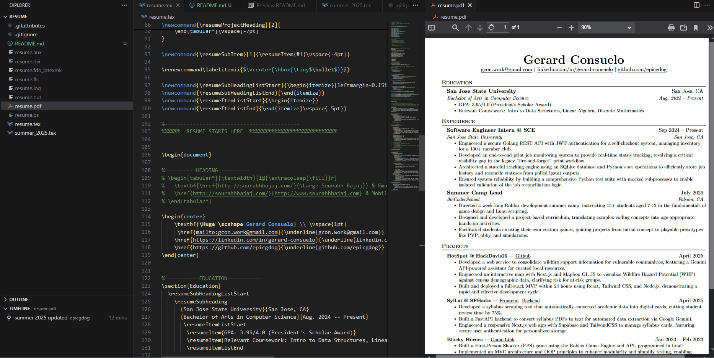

### My Resume
---

Hello guys, I am Gerard and this is a repository for my resume.

I was using OverLeaf, but the problem is that you need to pay to host your resume for a longer time than a year.
This is so annoying, so I decided to self-host (inspired by Nathan Tran)

To do this on your system, here's what you should do:

1. Install Perl and MikTek
2. Create a repository and a `old.tex` file to store my LaTex resume from OverLeaf.
3. Now, create `resume.tex` file and paste that LaTex resume
4. Create a `.gitignore` file and copy the .gitignore of this repo


Nice, we have our resume on github, now we will do the following, allowing you to see your edits after saving your `resume.tex`.

1. Open a command prompt and cd into your repo
2. Run the following: 
```
latexmk -pvc -pdf -interaction=nonstopmode resume.tex
```
3. Great! Now, do not close this terminal while editing.


Now, you should have a hot-reloading LaTex editor that doesn't require wifi (unless you need to import stuff from LaTex)

